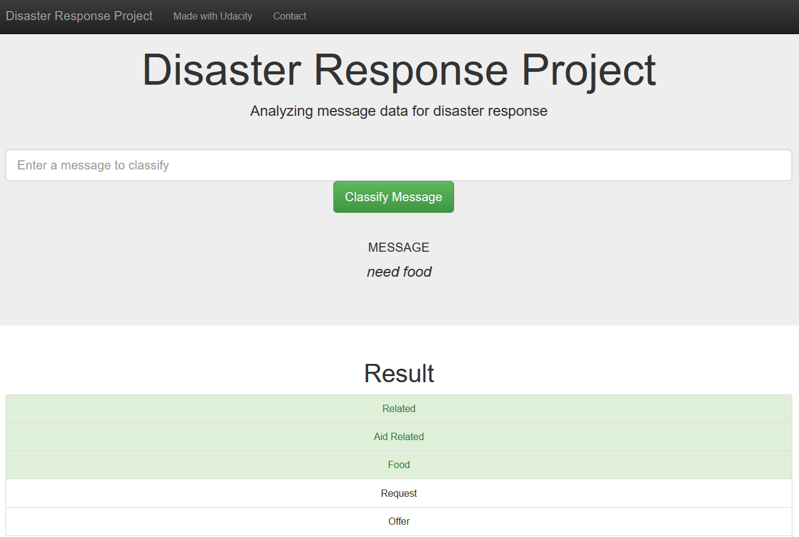

# Disaster Response Pipeline


## Table of Contents
1. [Description](#description)
2. [Getting Started](#getting_started)
	1. [Dependencies](#dependencies)
	2. [Installing](#installation)
	3. [Executing Program](#execution)
3. [Acknowledgement](#acknowledgement)
4. [Screenshots](#screenshots)

<a name="descripton"></a>
## Description

* This project is part of Data Science Nanodegree Program by [Udacity](https://www.udacity.com/) in collaboration with [Figure Eight](https://www.figure-eight.com/). The dataset contains pre-labelled tweets and messages from real-life disaster events. It aims to build a Natural Language Processing (NLP) model to categorize messages.

* Project is divided in the following key sections:

  1. ETL pipeline - Extracts and processes data from source, and save it to a SQLite DB
  2. ML pipeline - Builds a machine learning pipeline to train on the data, to classify text message in various categories
  3. Web App - Generates and displays model predictions for user entered message in real time

<a name="getting_started"></a>
## Getting Started

<a name="dependencies"></a>
### Dependencies
* Python 3.9+
* ML libraries: numPy, pandas, sciki-Learn, nltk
* Other libraries: sqlalchemy, joblib, flask, plotly

<a name="installation"></a>
### Installing
To clone the git repository:
```
git clone https://github.com/jeena72/disaster-response-pipeline.git
```
<a name="execution"></a>
### Executing Program:
1. You can run the following commands in the project's directory to set up the database, train model and save the model

    - To run ETL pipeline to clean data and store the processed data in the database
        `python data/process_data.py data/disaster_messages.csv data/disaster_categories.csv data/DisasterResponse.db`
    - To run the ML pipeline that loads data from DB, trains classifier and saves the classifier as a pickle file
        `python models/train_classifier.py data/DisasterResponse.db models/classifier.pkl`

2. Run the following command to run web app
    `python app/run.py`

3. Go to http://127.0.0.1:3001/

<a name="importantfiles"></a>
### Important Files
**app/templates/***: templates/html files for web app

**data/process_data.py**: Extract Train Load (ETL) script for data cleaning, feature extraction, and storing data in a SQLite database

**models/train_classifier.py**: Model fitting script that loads data, trains a model, and saves it as a .pkl file

**run.py**: Script for launching the Flask web app

<a name="acknowledgement"></a>
## Acknowledgements

* [Udacity](https://www.udacity.com/) for the Data Science Nanodegree Program
* [Figure Eight](https://www.figure-eight.com/) for providing the relevant dataset to train the model

<a name="screenshots"></a>
## Screenshots

1. An example of a message categorization (predicted categories highlighted in green)



2. Web app home page with some visualization of distributions in dataset


3. Sample run of train_classifier.py with precision, recall etc. for each category


